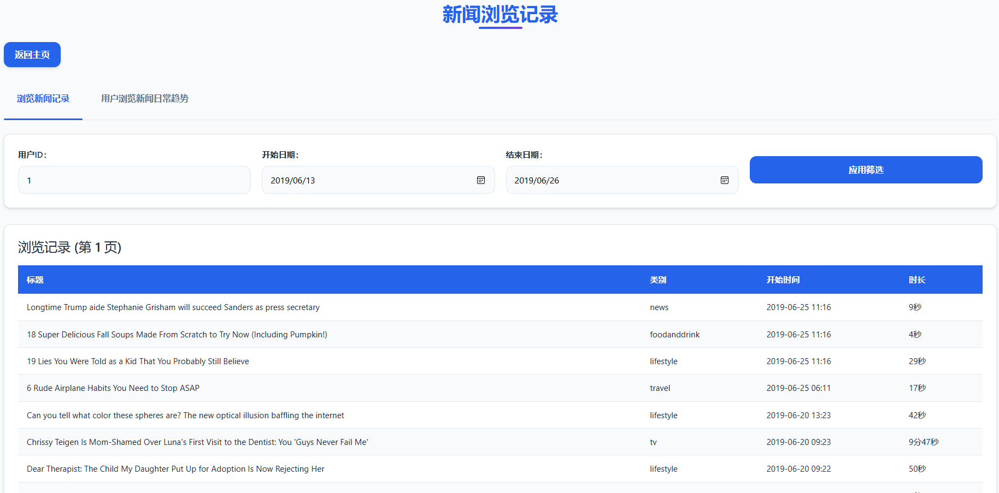

# 📰 NewsInsight 新闻数据分析平台

## 🚀 项目概述

**NewsInsight** 是一款集新闻聚合、智能分析、可视化与个性化推荐于一体的创新型新闻数据平台。平台基于 PENS 数据集，融合新闻内容与用户行为，构建结构化新闻数据库，助力高效检索、深度洞察与用户兴趣建模。

> 支持自然语言问答，用户可用日常语言轻松探索新闻趋势、热度与兴趣画像。系统采用 Blazor WebAssembly 前端、ASP.NET Core 后端、高性能 C++ 前缀匹配引擎，并支持 IIS 部署，实现跨平台、高并发和低延迟的稳定服务。

## 🧩 核心技术栈

|    模块    |                       技术组件                      |
| :------: | :---------------------------------------------: |
|  **前端**  |    Blazor WebAssembly · JavaScript · Chart.js   |
|  **后端**  | ASP.NET Core 9 · C#12 · Entity Framework Core 9 |
|  **算法层** |       C++17 (Trie 树) · C++/CLI (.NET 互操作)       |
|  **数据层** |                MySQL 8.0 · 分布式表设计               |
| **智能服务** |           MCP 协议 · VS Code Copilot 集成           |

## 💡 核心功能

### 📑 新闻内容管理

* **智能检索**：多条件筛选、关键词全文搜索、时间区间过滤
  `GET /api/news?category=video&keyword=university`
* **动态推荐**：前缀补全、个性化内容推送
  `GET /api/news/categories/match?prefix=sp`
* **内容获取**：一键获取新闻详情与元数据
  `GET /api/news/123`

### 📊 用户行为分析

* **历史记录**：分页浏览用户轨迹
* **趋势洞察**：阅读时长/频次趋势可视化
* **兴趣画像**：自动量化用户内容偏好

### 🔥 新闻热度监控

* 热度分析（浏览次数/时长等多维度）
* 历史趋势可视化（日粒度对比）

## ✨ 创新亮点 & MCP Server 智能服务架构

> 用更智能、更高效的方式连接新闻数据与AI能力

### 🧠 MCP Server 架构简述

* **MCP（Model Context Protocol）协议**
  标准化 LLM（大语言模型）与应用间的数据交互接口，支持多种智能工具插件化集成

* **分层服务结构**

  

  *本项目数据库位于云端ECS，可通过 Web APIs 与外部数据源交互，实现远程智能问答。*

* **核心功能支持**

  * 🗣️ **自然语言 SQL 查询生成**
    用户可用“说人话”的方式下达需求，系统自动生成安全 SQL，内置防护（如自动 LIMIT、防注入）。
  * ⚡ **一键执行查询**
    自动校验 SQL 合规性，友好返回查询结果，无需复杂操作。
  * 🎯 **智能新闻推荐**
    综合兴趣画像，多级偏好（类别/话题）精准推送，并明确展示推荐原因。
  * 🛠️ **Copilot Agent 深度集成**
    直接在 VSCode/前端用自然语言调用各项功能，研发与运营全场景高效联动。

### 👀 运行效果截图

  
  

## 🛠️ 部署说明

详见《NewsInsight部署安装说明》。

## 📷 项目截图

  
  
  
  
  
  

## 🏷️ 典型应用场景

* **个性化阅读助手**
  智能推荐，省去手动筛选，动态优化个人信息流体验。
* **热点趋势洞察**
  可视化热点分布，辅助内容决策与策略调整。
* **用户兴趣分析**
  自动生成兴趣画像，赋能内容推荐与广告投放。
* **智能数据问答**
  用自然语言问问题，平台直接返回精准数据，无需手动报表与筛查。

## 🔭 拓展方向

1. 🚦 **实时数据流**
   集成 Flume+Kafka，支持新闻流实时采集与智能处理
2. 🧑‍💻 **情感分析**
   基于大语言模型的评论极性智能识别
3. 📱 **跨平台适配**
   支持企业微信、智能音箱、AR 眼镜等多端接入
4. 🌐 **混合推理**
   本地轻量模型+云端大模型智能协作

- 如需了解更多，请参考《NewsInsight项目说明》
- 如需部署和集成详细信息，请参考《NewsInsight部署安装说明》

**平台支持模块化升级与多样化拓展，持续适配未来业务发展需求**
